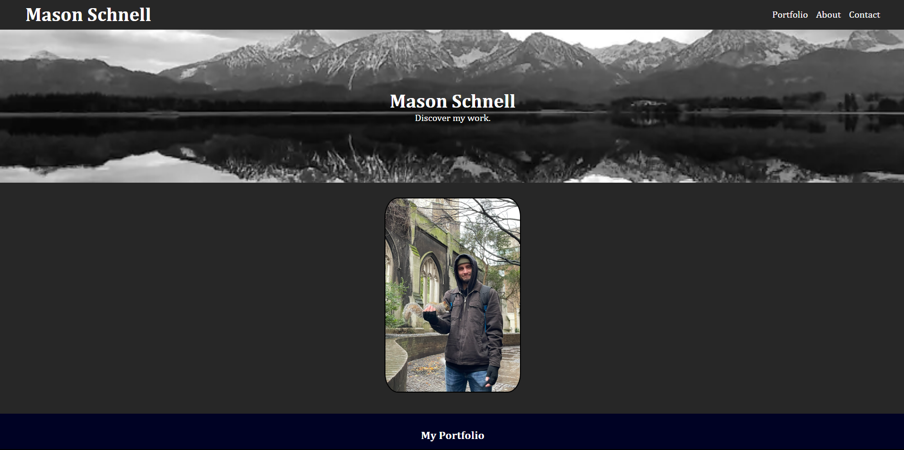

# Full Stack Developer Student Portfolio

This website provides a template that developers can use to showcase their work and increase their chances of getting a job.

[Website Link](https://masonschnell.github.io/professional-portfolio/)

## Overview

### Technologies Used

-   HTML
-   CSS

## Projects

1. **Horiseon Technological Marketing**

    - This webpage is to help facilitate Technological Marketing to buissness so that they can better interact with consumers.
    - [GitHub Repository](https://github.com/MasonSchnell/horiseon-challenge)
    - [Website Link](https://masonschnell.github.io/horiseon-challenge/)

2. **Prework Study Guide**

    - This webpage helps bootcamp students store their notes from their classes.
    - [GitHub Repository](https://github.com/MasonSchnell/prework-study-guide)
    - [Website Link](https://masonschnell.github.io/prework-study-guide/)

3. **Placeholder Project**
    - This appplication is not currently in development but its inclusion allowed me to demonstrate the formatting of the page.

## Credits

-   Rutgers Full Stack Development Team

## Contact Information

-   **Email**: masonschnell1@gmail.com
-   **GitHub**: [MasonSchnell](https://github.com/MasonSchnell)

## License

This portfolio is available through the [MIT License](LICENSE).
